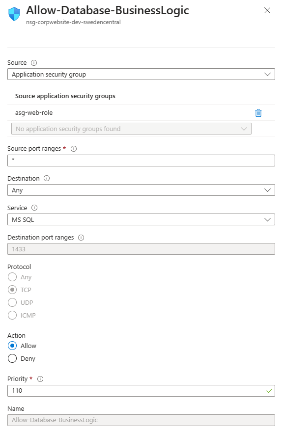
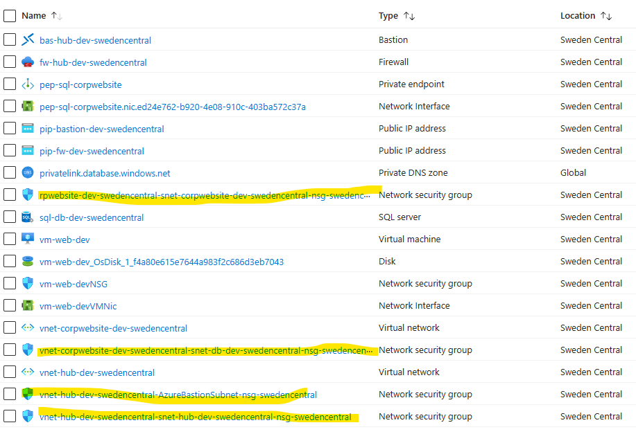

# Routes & network security demo

Run the [setup.ps1](setup.ps1) script, which creates:

- Two virtual peered networks (Corp website and Hub)
- Virtual machine that acts as a web server in the Corp website virtual network.
- Azure SQL with private link in the Corp website virtual network
- Azure Firewall
- Azure Bastion

> [Powershell handles empty quotes](https://learn.microsoft.com/en-us/cli/azure/use-cli-effectively?tabs=bash%2Cbash2#use-quotation-marks-in-parameters) differently than bash. If you want to run the script from Powershell, you need to replace `""` with `'""'`.

> The script is not digitally signed, so you might have to run `Set-ExecutionPolicy -ExecutionPolicy Unrestricted -Scope CurrentUser` to allow it to run.

All demos are in the Azure portal.

The web server VM `vm-web-dev` is used to demonstrate the scenarios. Login via Bastion with username `azureuser` and your local ssh private key found in the following locations:

- `C:\Users\<username>\.ssh\id_rsa`
- `~/.ssh/id_rsa`

## System routes

Navigate to the Virtual Machine -> Networking -> Nic -> Effective routes and show the system routes.

| Source | Address Prefixes | Next hop type | Description |
|---|---|---|---|
| Default | 10.0.0.0/16 | Virtual network | Routing within the Corp website virtual network |
| Default | 10.1.0.0/16 | VNet peering | Routing to the Hub virtual network |
| Default | 0.0.0.0/0 | Internet | 0.0.0.0/0 is a catch all rule, so if none of the more specific rules apply, route to the Internet |
| Default | 10.0.0.8/0 | None | An example of a reserved address space, where all traffic gets dropped |

Azure automatically adds routes to the system route table when you create a virtual network, VPN gateway, or virtual network peering. Only when you want to change the default behavior, you need to add custom routes.

## Network segmentation with NSG and ASG

1. Create ASG `asg-web-role` and assign it to the nic of the web server/VM
1. Create NSG `nsg-db-dev-swedencentral` and associate with subnet `snet-db-dev-swedencentral`. Because the AllowVNetInBound default security rule allows all communication between resources, this rule is needed to deny traffic from all resources.
    - Create rule `Deny-Database-All`
    - with priority 120
    - source any
    - destination any
    - service ms sql  (port 1433)
1. Show it is not possible to access the database from the web server

    ```bash
    telnet sql-db-dev-swedencentral.database.windows.net 1433
    ```

1. Create rule `Allow-Database-BusinessLogic`
    - with priority 110
    - allow from application security group `asg-web-role`
    - destination any
    - service ms sql  (port 1433)

    
1. Show it is now possible to access the database from the web server

    ```bash
    telnet sql-db-dev-swedencentral.database.windows.net 1433
    ```

> Note internal Microsoft processes create NSGs via policies for each subnet. Show they exists, so people are aware of them. 

## Firewall & routing

First of all outbound traffic should be routed via the firewall. This is done by creating a route table and associating it with the subnets.

1. Create route table `rt-corpwebsite-dev-swedencentral`
1. Associate it with subnet `snet-web-dev-swedencentral` and `snet-db-dev-swedencentral`
1. Add route `outbound-firewall`
    - Destination IP Addresses
    - Destination 0.0.0.0/0 (meaning Internet traffic)
    - Network type Virtual appliance
    - Next hop internal IP of the firewall

This routes all Internet traffic via the firewall.

By default the Firewall allows no traffic. You need to create rules to allow traffic. We already created and outbound network rule allowing DNS lookups.

- NAT rules - allows you to share network services with external networks. E.g. you can use a single public IP address to allow external clients to access multiple internal servers.
- Network rules - non-HTTP/S traffic that will be allowed to flow through the firewall must have a network rule.
- Application rules - HTTP/HTTPS traffic at Layer-7 network traffic filtering.

> Rules are processed according to the rule type priority, but network rules are processed before application rules.

1. Connect to the `vm-web-dev` and show you can do DNS lookups, but now HTTP requests

    ```bash
    nslookup www.google.com
    nslookup www.microsoft.com
    curl www.google.com
    ```

1. Show we have a network rule that allows DNS lookups
1. Create new application rule collection `apprule-http` with priority 100
    - with action Allow
    - with rule type HTTP,HTTPS
    - with source IP address *
    - FQDN *.google.com
1. Connect to the `vm-web-dev` and show HTTP requests to www.google.com is allowed

    ```bash
    curl www.google.com
    curl www.microsoft.com
    ```
