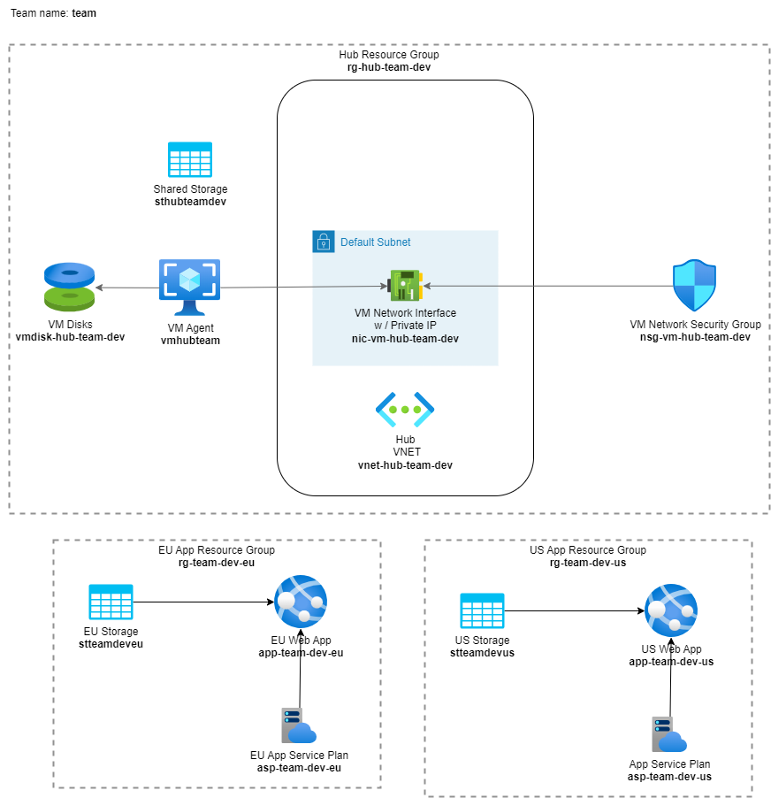

# Warm-up

Let's provision our first resources in Azure!

It is recommended to use Azure Cloud Shell for the exercises, as it has all the tools you need to complete the exercises. You can access the Azure Cloud Shell via the portal or go to [shell.azure.com](https://shell.azure.com/).

1. Make sure the Cloud Shell is using PowerShell:

    

1. Clone this repository into the Cloud Shell:

    ```ps1
    git clone https://github.com/Lybecker/AzureSecureNetworkingForSoftwareEngineers/
    ```

1. Navigate to folder `/exercises/scripts/`:

    ```ps1
    cd ./AzureSecureNetworkingForSoftwareEngineers/exercises/scripts/
    ```

1. Set environment variables defining the team name and the Azure locations (regions) to use:

    ```ps1
    .\set-env.ps1 -TeamName <your team name>
    ```

    > **Important:** The team name should be given as lower case alphanumeric characters with the maximum length of 10. This is because it is used in the resource names that can have very short allowed length.

1. Run the script to provision resources, but **read the notes below** before doing this:

    ```ps1
    .\0-prerequisites.ps1
    ```

    > Make sure your working directory is `scripts` when running the script. This is because the web app code package to deploy is referenced using a relative path.
    >
    > There are three locations (regions) we will be using during the exercises. The default values shown in the table below:
    >
    > | Region | Environment variable name | Default location |
    > | ------- | ------------------------ | ---------------- |
    > | EU | `EU_LOCATION` | West Europe (`westeurope`) |
    > | US | `US_LOCATION` | East US (`eastus`) |
    > | Hub | `HUB_LOCATION` | Sweden central (`swedencentral`) |
    >
    > You also have an option to set the jumpbox virtual machine username and password with `-JumpboxAdminUsername` and `-JumpboxAdminPassword` parameters. Otherwise the default values - *check what they are in the script* - will be used.

    If all goes well, you should now have the [resources](#status-check) deployed including the code for the web apps.

## Status check

Test the web apps and generate blobs:

1. In your browser, navigate to the web app in the EU region: `https://app-<your team name>-dev-eu.azurewebsites.net/`
1. Generate blobs: `https://app-<your team name>-dev-eu.azurewebsites.net/create_blobs`
1. List blobs: `https://app-<your team name>-dev-eu.azurewebsites.net/list_blobs`
1. Repeat the steps for the app service in the US region

We should now have the following resources created:



The main resources are listed in the table below.

| Resource type | Resource name | Resource group | Default location |
| ------------- | ------------- | -------------- | ---------------- |
| Storage account | `sthub{team name}dev` | `rg-hub-{team name}-dev` | Sweden central |
| Storage account | `st{team name}deveu` | `rg-{team name}-dev-eu` | West Europe |
| Storage account | `st{team name}devus` | `rg-{team name}-dev-us` | East US |
| App service plan (Linux) | `asp-{team name}-dev-eu` | `rg-{team name}-dev-eu` | West Europe |
| App service plan (Linux) | `asp-{team name}-dev-us` | `rg-{team name}-dev-us` | East US |
| Web app service | `app-{team name}-dev-eu` | `rg-{team name}-dev-eu` | West Europe |
| Web app service | `app-{team name}-dev-us` | `rg-{team name}-dev-us` | East US |
| Virtual machine (jumpbox) | `vm{team name}` | `rg-hub-{team name}-dev` | Sweden central |

## Tips and tricks: Naming is hard

Links to help with naming resources (these will be useful later):

* [Abbreviation examples for Azure resources](https://learn.microsoft.com/azure/cloud-adoption-framework/ready/azure-best-practices/resource-abbreviations)
* [Naming rules and restrictions for Azure resources](https://learn.microsoft.com/azure/azure-resource-manager/management/resource-name-rules)

## Back to the overview

[Azure Secure Networking for Developers - start page](/README.md)
