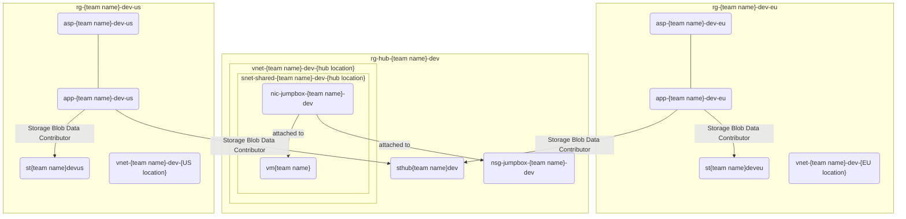

# Virtual networks

Let's start simple. Your mission, should you accept it, is to create two virtual networks. These virtual networks will form a network boundary around the Azure resource assigned to them, allowing you to control all traffic to and from.

Each one should span 1024 IP addresses with first virtual network starting from IP address `10.0.0.0`. In fact, we already have one virtual network created: `vnet-{team name}-dev-{hub location}` in the hub location (region)!

Have the address spaces of the following virtual networks adjacent i.e, to be next to each other i.e., no empty space between the address spaces.

Use the recommended names below as per [Abbreviation examples for Azure resources](https://learn.microsoft.com/azure/cloud-adoption-framework/ready/azure-best-practices/resource-abbreviations) and create:

1. `vnet-{team name}-dev-{EU location}` in EU (starting from 10.0.4.0)
1. `vnet-{team name}-dev-{US location}` in US

If you have time left over, debate the existentialism of virtual networks. Are they real? Am I?

## Status check

The current state of affairs should look something like this:

## Tips and tricks

### Learning resources

* [What is Azure Virtual Network?](https://learn.microsoft.com/azure/virtual-network/virtual-networks-overview)
* [Quickstart: Use the Azure portal to create a virtual network](https://learn.microsoft.com/azure/virtual-network/quick-create-portal)

### Relevant Azure CLI commands

* [az network vnet create](https://learn.microsoft.com/cli/azure/network/vnet?view=azure-cli-latest#az-network-vnet-create())

### Tools

* [CIDR to IPv4 Conversion](https://www.ipaddressguide.com/cidr)

## Back to the overview

[Azure Secure Networking for Developers - start page](/README.md)
