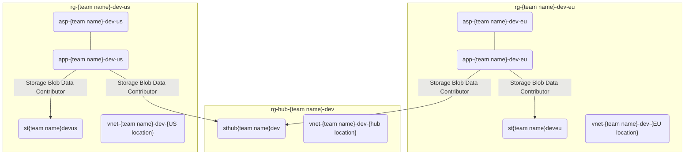

# Virtual networks

Let's start simple. Your mission, should you accept it, is to create three virtual networks. These virtual networks will form a network boundary around the Azure resource assigned to them, allowing you to control all traffic to and from.

Each one should span 1024 IP addresses with first virtual network starting from IP address `10.0.0.0`. Have the address spaces of all the virtual networks adjacent i.e, to be next to each other i.e., no empty space between the address spaces.

The recommended order and names below:

1. `vnet-{team name}-dev-{hub location}` in the hub location (region) (starting from 10.0.0.0) e.g., `vnet-crzycatseyes-dev-swedencentral`
1. `vnet-{team name}-dev-{EU location}` in EU
1. `vnet-{team name}-dev-{US location}` in US

If you have time left over, debate the existentialism of virtual networks. Are they real? Am I?

## Status check

The current state of affairs should look something like this:

