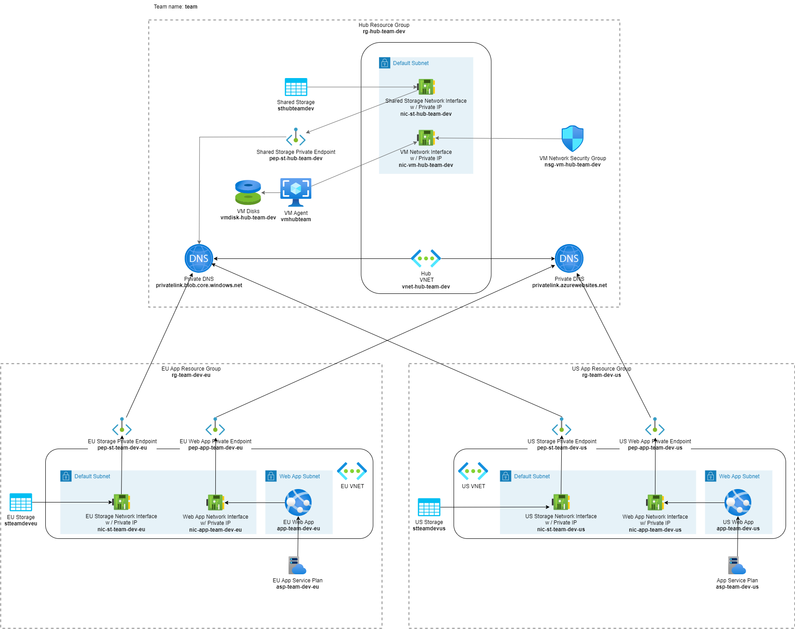

# Some privacy, please!

> *(With trailer man sound) Previously on Azure secure networking exercise...*
>
> In case you need to catch up, run the script to get to where we need to be now:
>
> ```ps1
> .\1-vnets.ps1
> ```

## Subnets

Our virtual networks sure feel empty and sad. Let's cheer them up by giving them subnets! In both the EU and US virtual networks, create:

1. `snet-default-{team name}-dev-{location}`, where location is "`eu`" or "`us`", with the range of 128 addresses
1. `snet-apps-{team name}-dev-{location}` with the range of 128 addresses
    * Delegate this subnet for `Microsoft.Web/serverFarms`

> The `default` subnet is for any kind of Azure resources. The `apps` subnet is delegated to Azure web apps, meaning you cannot use it for anything else.

[Steps to create Subnet in azure portal](https://learn.microsoft.com/en-us/azure/virtual-network/virtual-network-manage-subnet?tabs=azure-portal#add-a-subnet)

## Private DNS zones

Now, on to some D-N-S-ing (if that's not a word, it darn well should be).

1. Create two [private DNS zones](https://learn.microsoft.com/azure/dns/private-dns-privatednszone), in the **hub resource group**, for:
    1. Web apps ("`privatelink.azurewebsites.net`")
    1. Blob storages ("`privatelink.blob.core.windows.net`")

    > DNS zones are a global resource, so you only need to create them once, but they need to reside in a resource group.
    >
    > You created them in the hub - **H-U-B! That spells hub!** - resource group, right? Please say you did.
1. Link the created DNS zones to **all three** virtual networks with [virtual network links](https://learn.microsoft.com/azure/dns/private-dns-virtual-network-links)
    * There's no official naming recommendation, but this one works: `<Virtual network name>-<DNS zone name>` with dots replaced with dashes e.g., `vnet-{team name}-dev-eu-privatelink-azurewebsites-net`

[Steps to create Private DNS Zones in azure portal](https://learn.microsoft.com/en-us/azure/dns/private-dns-getstarted-portal)


> ☆ **Fun fact!** ☆
>
> DNS was first discovered by the German engineer Johann Albert Eytelwein in 1801, when a pulley fell on his head during an experiment. Sadly, after waking up he had no recollection of the idea and it would take almost another 200 years until the concept was rediscovered.

## Private endpoints

The private networks and DNS zones will do us no good, if they are not used. It would be a terrible waste to just leave them collecting dust. Get the point? Get it? Like the end... **point**! My mom thinks I'm funny.

For storage accounts and web app services:

> That is, 3 storage accounts and 2 web apps in total. We suggest your team split the work. See also the shortcut details below.

1. Create [private endpoints](https://learn.microsoft.com/azure/private-link/private-endpoint-overview)

    > Use the following resource name pattern:
    >
    > * Private endpoint name: `pep-{resource name}` e.g., for the hub storage account `pep-st{team name}devhub`
    > * Network interface name: `nic-pep-{resource name}`

1. Add [private DNS zone records](https://learn.microsoft.com/azure/private-link/private-endpoint-dns#private-dns-zone-group) for the endpoints
1. Link the private endpoints to appropriate virtual networks and subnets

> **Note:** Azure web apps are a little bit special. They have private endpoints and VNET integration. Don't worry, you will figure it out!

<!--
> ⏭ **Shortcut available** ⏭
>
> When you have successfully configured private endpoints for a one storage account and app service, you may run the catch-up script (`2-private-network.ps1`) at the end of this exercise to configure the rest, because the work is rather repetitive and time consuming. **Note** that you must have followed the naming convention in order for the script to run successfully.
-->
[Steps to create Private Endpoint in azure portal](https://learn.microsoft.com/en-us/azure/private-link/create-private-endpoint-portal?tabs=dynamic-ip)

## Disable access and enable web app VNET integration

All the hard work is done, but we are not quite finished yet. We created virtual networks and private endpoints for the Azure resources to protect them from the prying eyes of the public internet.

Now, disable public internet access to app services and storage accounts:

<!-- 1. The access to the storage accounts should be only allowed from the virtual network they are in -->
1. The public access to all three storage accounts should be disabled
1. The app services should have access restrictions and private endpoints **on**

Enable the virtual network (VNET) integration for the outbound traffic for both EU and US web apps. No traffic should ever leave the virtual networks.

## Status check

Launch any of the two web apps (e.g., `https://app-<your team name>-dev-eu.azurewebsites.net/`) in your browser. You should now be greeted with not so friendly 403 message.

How about those resources - sure keep piling up, eh? Notice something funny regarding the app services with respect to subnets?



## Tips and tricks

### Learning resources

* [Add, change, or delete a virtual network subnet](https://learn.microsoft.com/azure/virtual-network/virtual-network-manage-subnet?tabs=azure-portal)
* [What is a private Azure DNS zone?](https://learn.microsoft.com/azure/dns/private-dns-privatednszone)
* [What is a private endpoint?](https://learn.microsoft.com/azure/private-link/private-endpoint-overview)

### Relevant Azure CLI commands

* [az-network-vnet-subnet-create](https://learn.microsoft.com/cli/azure/network/vnet/subnet?view=azure-cli-latest#az-network-vnet-subnet-create)
* [az network private-dns zone create](https://learn.microsoft.com/cli/azure/network/private-dns/zone?view=azure-cli-latest#az-network-private-dns-zone-create)
* [az network private-dns link vnet create](https://learn.microsoft.com/en-us/cli/azure/network/private-dns/link/vnet?view=azure-cli-latest#az-network-private-dns-link-vnet-create)
* [az network private-endpoint create](https://learn.microsoft.com/cli/azure/network/private-endpoint?view=azure-cli-latest#az-network-private-endpoint-create)
* [az network private-endpoint dns-zone-group add](https://learn.microsoft.com/en-us/cli/azure/network/private-endpoint/dns-zone-group?view=azure-cli-latest#az-network-private-endpoint-dns-zone-group-add)
* [az resource update](https://learn.microsoft.com/cli/azure/resource?view=azure-cli-latest#az-resource-update)
* [az webapp vnet-integration add](https://learn.microsoft.com/cli/azure/webapp/vnet-integration?view=azure-cli-latest#az-webapp-vnet-integration-add)

## Back to the overview

[Azure Secure Networking for Developers - start page](/README.md)
