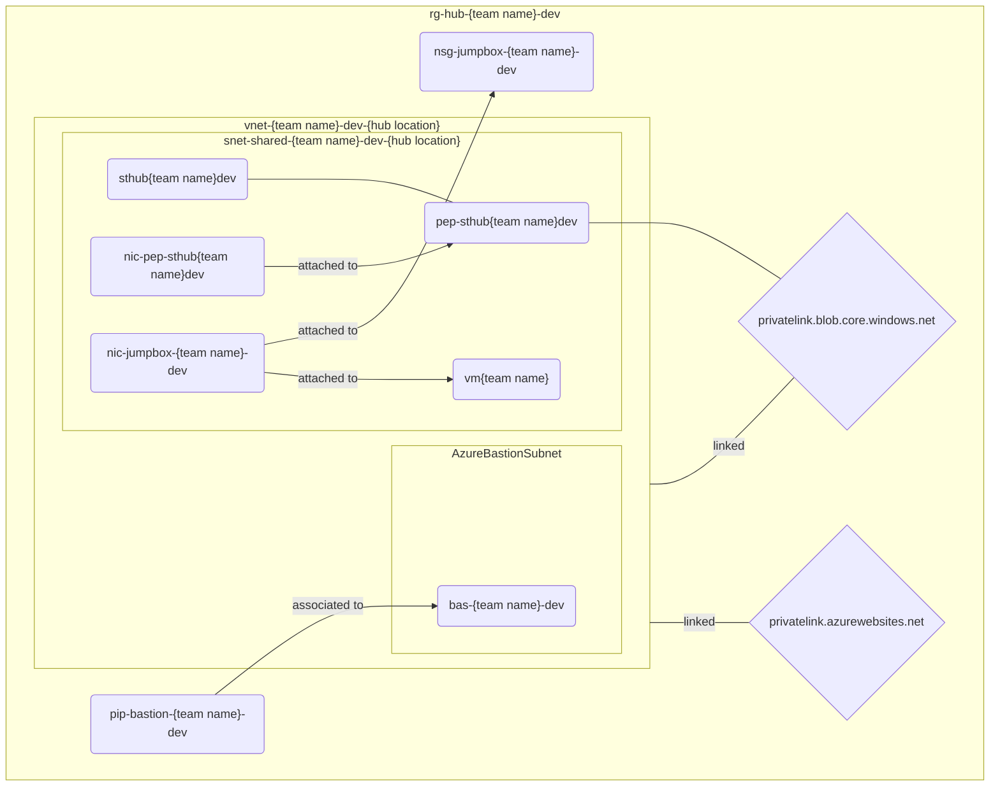

<!-- markdownlint-disable MD033 -->
# <strike>None</strike>Some shall pass
<!-- markdownlint-enable MD033 -->

> Ooh wee! The previous exercise sure was tedious. I don't blame you, if you didn't get all the way through. To catch up, run the script:
>
> ```ps1
> .\2-private-network.ps1
> ```

Oops! Anybody got the key? Now, this is embarrassing; I think we just locked ourselves out of the entire system! Try it out by access the web apps or storage accounts.

Let's fix that!

## Virtual machine

1. Create [network security group (NSG)](https://learn.microsoft.com/azure/virtual-network/network-security-groups-overview) in the **hub location**.
1. Create a Windows desktop virtual machine, in the **hub location**, with no public IP or public inbound ports. Assign the network security group to the virtual machine.

> Naming recommendations:
>
> * NSG: `nsg-jumpbox-{team name}-dev`
> * VM: `vm{team name}` (Windows VM resource names are [restrictred to maximum of 15 characters](https://learn.microsoft.com/azure/azure-resource-manager/management/resource-name-rules#microsoftcompute))

## Bastion

So, umm... we created a virtual machine we can't access. What was the point of that?!

The solution:

> **Note:** When creating Bastion in Azure portal, the subnet and the public IP address can be created in the same process and do not need to be separately provisioned.

1. Create a subnet for Azure Bastion in the VNET in the **hub location** - the name and size need to be specific and you must figure out what they are
1. Create a public IP address in the **hub location**
1. Create [Azure Bastion](https://learn.microsoft.com/azure/bastion/bastion-overview) resource in the **hub location** using the newly created public IP address and add it to the virtual network

> Naming recommendations:
>
> * Public IP address: `pip-bastion-{team name}-dev`
> * Bastion: `bas-{team name}-dev`

Login to the virtual machine using Azure Bastion and verify that your Private DNS zones work by running the following command in the command prompt/PowerShell: `nslookup app-<your team name>-dev-eu.azurewebsites.net`. You should see an IP in the private IP address space. Try accessing the web app in the browser of your jumpbox - does that work? Should it?

This exercise can only be completed by installing Solitaire and winning the game. Extra points for pro mode i.e., allowing only one time to go through the deck.

## Status check

EU and US resource groups are omitted since we didn't touch them in this exercise.



## Tips and tricks

### Learning resources

* [Quickstart: Deploy Azure Bastion with default settings](https://learn.microsoft.com/azure/bastion/quickstart-host-portal)

### Relevant Azure CLI commands

* [az network nsg create](https://learn.microsoft.com/cli/azure/network/nsg?view=azure-cli-latest#az-network-nsg-create())
* [az network nsg rule create](https://learn.microsoft.com/cli/azure/network/nsg/rule?view=azure-cli-latest#az-network-nsg-rule-create())
* [az network nic create](https://learn.microsoft.com/cli/azure/network/nic?view=azure-cli-latest#az-network-nic-create())
* [az vm image list](https://learn.microsoft.com/cli/azure/vm/image?view=azure-cli-latest#az-vm-image-list())
* [az vm create](https://learn.microsoft.com/cli/azure/vm?view=azure-cli-latest#az-vm-create())
* [az network public-ip create](https://learn.microsoft.com/cli/azure/network/public-ip?view=azure-cli-latest#az-network-public-ip-create())
* [az network bastion create](https://learn.microsoft.com/cli/azure/network/bastion?view=azure-cli-latest#az-network-bastion-create())
