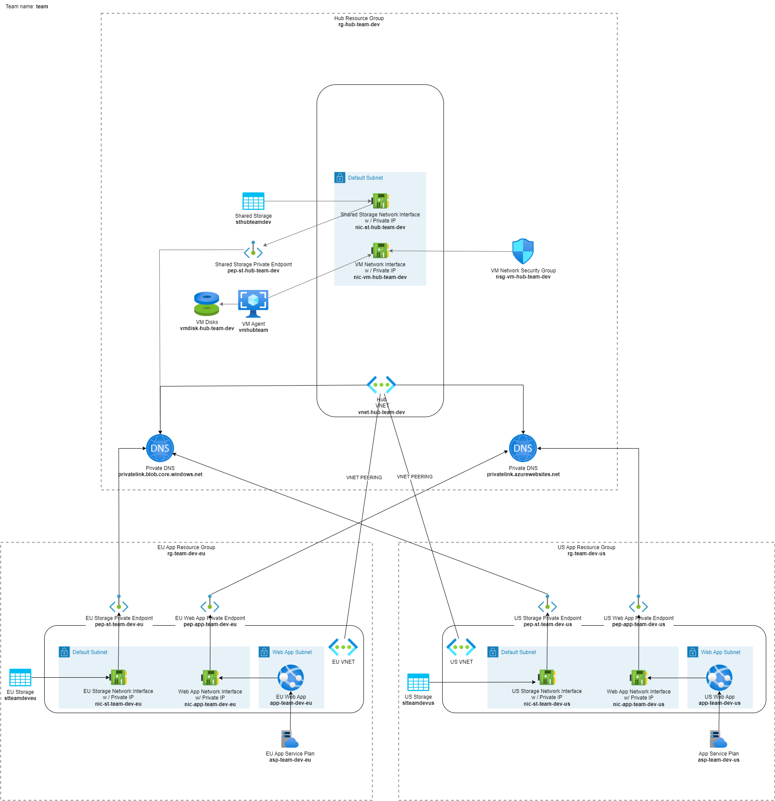

# Cells interlinked

> Ooh wee! The previous exercise sure was tedious. I don't blame you, if you didn't get all the way through. To catch up, run the script:
>
> ```ps1
> .\2-private-network.ps1
> ```

Virtual networks, like galaxies. Systems of cells interlinked within cells interlinked. *Cells interlinked*. Drifting away in the empty vastness of silent space. In solitude, forever to travel alone until the last dark star shines its last light.

<!-- markdownlint-disable MD033 -->
&nbsp;&nbsp;&nbsp;&nbsp;&nbsp;&nbsp;&nbsp;&nbsp;&nbsp;&nbsp;&nbsp;&nbsp;Against the dark, a tall white fountain played.<p>...</p>
<!-- markdownlint-enable MD033 -->

## Virtual network peering

Right... It's kinda important for our case that the virtual networks are connected. In order to do that we need to [peer](https://learn.microsoft.com/azure/virtual-network/virtual-network-peering-overview) them using a [hub and spoke (hub-spoke)](https://learn.microsoft.com/azure/architecture/reference-architectures/hybrid-networking/hub-spoke?tabs=cli) model. Remember, the spokes are the virtual networks in EU and US. Enough talking, let's get to it: Peer the virtual networks so that the one in the hub location acts as the hub. What are you waiting for? Go! Execute!

[Steps to Create virtual network peering from azure portal](https://learn.microsoft.com/en-us/azure/virtual-network/virtual-network-manage-peering?tabs=peering-portal)

## Status check

<!--
TODO: The old status check below won't work anymore, because we moved the Bastion step *after* this exercise. Instead, instruct to inspect the network topology in Azure portal.

Now you should be able to open a browser in the virtual machine and navigate to the web app `https://app-<your team name>-dev-eu.azurewebsites.net/list_blobs` in the virtual network. If you can't, you're doing something wrong.
-->

And how about our current infrastructure; this is rather simple, isn't it?



## Tips and tricks

### Relevant Azure CLI commands

* [az network vnet peering create](https://learn.microsoft.com/cli/azure/network/vnet/peering?view=azure-cli-latest#az-network-vnet-peering-create())

## Back to the overview

[Azure Secure Networking for Developers - start page](/README.md)
