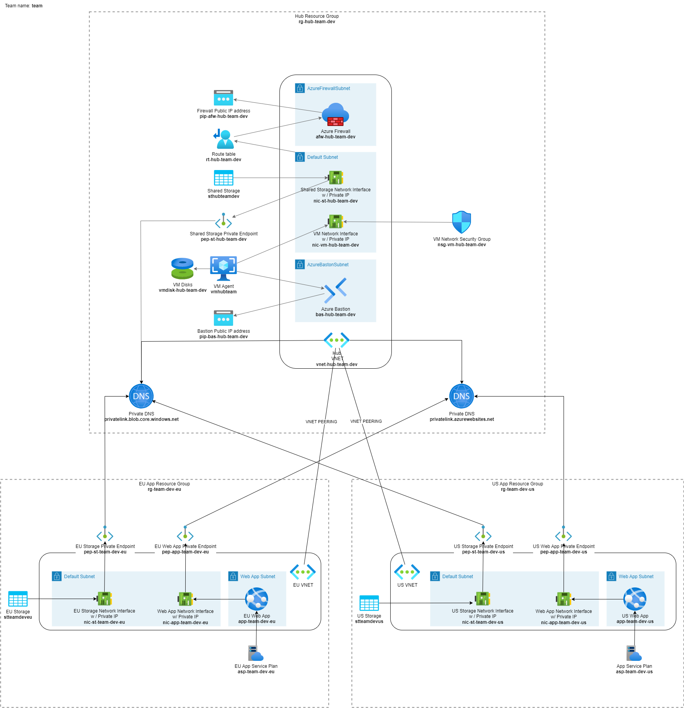

# Shields up, red alert!

> That Bastion stuff wasn't that bad, was it? But in case you were playing Solitare the entire time, here you go:
>
> ```ps1
> .\4-bastion-jumpbox.ps1
> ```

You secured a lot of stuff in the previous exercises, but there's still a lot of work to do. Let's get to it!

We would like restrict data exfiltration of data. That means controlling the traffic between the virtual network and the internet. We'll do that by setting up a firewall to route all egress (outgoing) traffic through.

## Firewall setup

Now it is time to get familiar with [Azure Firewall](https://learn.microsoft.com/azure/firewall/overview).

Create an Azure firewall (choose Standard SKU as it support network level FQDN filtering) - it requires some extra ressources, but you will figure it out.

Azure Firewall and Azure Bastion are resources that are prime for sharing between solution, so they should be placed in the hub virtual network. This means that they can be used by all virtual networks in the hub.

> Cost is another reason to not create many instances of Azure Firewall and Azure Bastion. They are both billed for allocation per hour and for data traffic processed. Unlike e.g. Azure Key Vault that only is billed per usage.

By default the Firewall allows no traffic. You need to create rules to allow traffic. There are three types of rules:

- NAT rules - allows you to share network services with external networks. E.g. you can use a single public IP address to allow external clients to access multiple internal servers.
- Network rules - non-HTTP/S traffic that will be allowed to flow through the firewall must have a network rule.
- Application rules - HTTP/HTTPS traffic at Layer-7 network traffic filtering.

> [Azure Firewall SKU comparison](https://learn.microsoft.com/en-us/azure/firewall/choose-firewall-sku).

[Steps to configure firewall from azure portal](https://learn.microsoft.com/en-us/azure/firewall/tutorial-firewall-deploy-portal)

## Routing

The firewall is not used yet, so route all Internet traffic through it from all virtual networks.

1. Add a [route table](https://learn.microsoft.com/azure/virtual-network/manage-route-table) with prefix `rt-`, assign it to each subnet and route like this:
    - Destination: 0.0.0.0/0 (Internet)
    - Next hop type: Virtual appliance
    - Next hop address: Private IP of firewall
1. Via the jumpbox verify that all Internet requests are denied.

> Note: a route table can only be associated with a subnet in the same virtual network. This means that you need to create a route table for each virtual network.

[Steps to create route table from azure portal](https://learn.microsoft.com/en-us/azure/virtual-network/manage-route-table)

## Firewall rules

1. Create firewall rule(s) to block all sites except GitHub.com
2. Via the jumpbox verify the all other sites than GitHub.com is denied.

> If you configure network rules and application rules, then network rules are applied in priority order before application rules. The rules are terminating. So, if a match is found in a network rule, no other rules are processed.

## Status check

The current status of the hub resource group should now be as depicted below.



## Tips and tricks

### Learning resources

- [What is Azure Firewall?](https://learn.microsoft.com/azure/firewall/overview)

### Relevant Azure CLI commands

- [az network firewall create](https://learn.microsoft.com/cli/azure/network/firewall?view=azure-cli-latest#az-network-firewall-create(azure-firewall))
- [az network firewall ip-config create](https://learn.microsoft.com/cli/azure/network/firewall/ip-config?view=azure-cli-latest#az-network-firewall-ip-config-create(azure-firewall))
- [az network firewall update](https://learn.microsoft.com/cli/azure/network/firewall?view=azure-cli-latest#az-network-firewall-update(azure-firewall))

## Back to the overview

[Azure Secure Networking for Developers - start page](/README.md)
