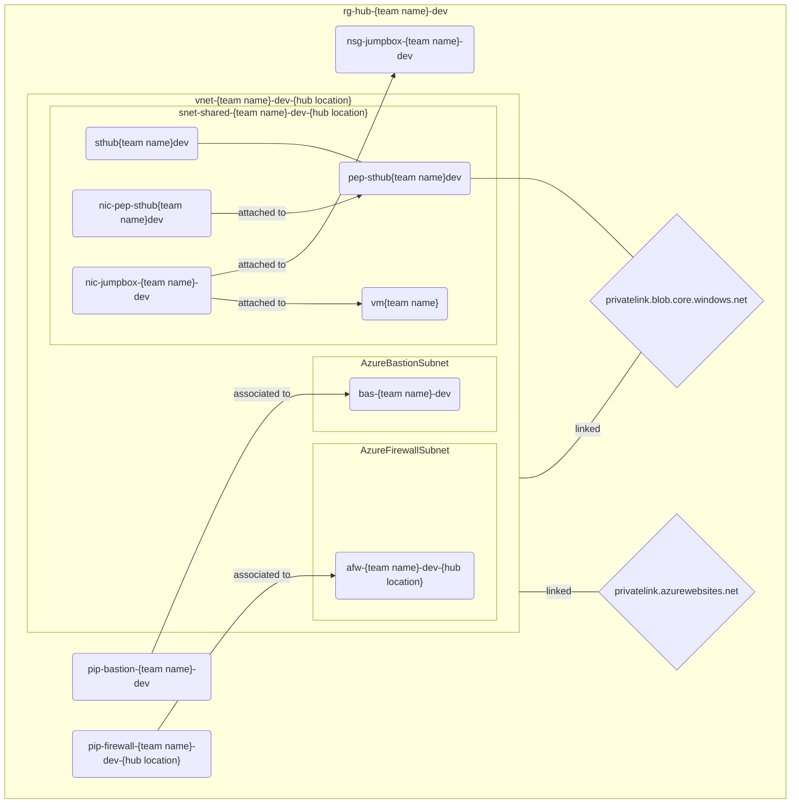

# Extra credit: Shields up, red alert!

> Gotta have them networks peered so if they ain't, go do it:
>
> ```ps1
> .\4-vnet-peerings.ps1
> ```

## Firewall

Set up [Azure Firewall](https://learn.microsoft.com/azure/firewall/overview) - not the basic SKU - in the virtual network in the **hub location**.

## Routing

Finally:

1. Add a [route table](https://learn.microsoft.com/azure/virtual-network/manage-route-table) and direct next hop traffic from VM to Azure Firewall
1. Block all sites except GitHub

## Status check


