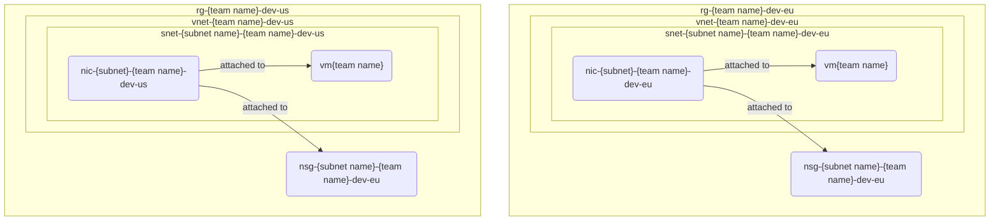

# Previously on Networking

> *intro music plays* as our hero wanders in the wild:
>
> ```ps1
> .\5-firewall.ps1
> ```

## Network Security Group

1. Create [network security group (NSG)](https://learn.microsoft.com/azure/virtual-network/network-security-groups-overview) in **EU and US** locations.
2. Create [network security group rule (NSG)](https://learn.microsoft.com/azure/virtual-network/network-security-groups-overview#security-rules) to allow inbound SQL port.
3. Create a Linux desktop virtual machine, in both locations, with no public IP or public inbound ports. Assign the network security group to the virtual machine.

> Naming recommendations:
>
> * NSG: `nsg-{subnet-name}-{team name}-dev`
> * VM: `vm{team name}` (Linux VM resource names are [restrictred to maximum of 15 characters](https://learn.microsoft.com/azure/azure-resource-manager/management/resource-name-rules#microsoftcompute))

## Status check



## Tips and tricks

* [Network traffic with network security group](https://learn.microsoft.com/en-gb/azure/virtual-network/tutorial-filter-network-traffic)

### Relevant Azure CLI commands

* [az network nsg create](https://learn.microsoft.com/cli/azure/network/nsg?view=azure-cli-latest#az-network-nsg-create())
* [az network nsg rule create](https://learn.microsoft.com/cli/azure/network/nsg/rule?view=azure-cli-latest#az-network-nsg-rule-create())
* [az network nic create](https://learn.microsoft.com/cli/azure/network/nic?view=azure-cli-latest#az-network-nic-create())
* [az vm image list](https://learn.microsoft.com/cli/azure/vm/image?view=azure-cli-latest#az-vm-image-list())
* [az vm create](https://learn.microsoft.com/cli/azure/vm?view=azure-cli-latest#az-vm-create())
