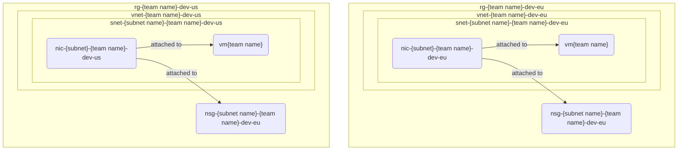

# Previously on Networking

> *intro music plays* as our hero wanders in the wild:
>
> ```ps1
> .\5-firewall.ps1
> ```

## Network Security Group

In this exercise, we will cover network security group and how to apply it.

Network security group is being used for filtering network traffic within Azure virtual network. With security rules, you can either allow or deny the traffic. This comes in handy especially working with multiple Azure resources and filtering the access. We need this type of filtering within our Azure virtual networks to limit access to database. In our scenario, database resource should only be accessed via SQL port only. If we don't limit the traffic, this can lead vulnerability on accessing database resource via SSH, HTTP or other ports.

Let's jump on the exercise;

1. Create [network security group (NSG)](https://learn.microsoft.com/azure/virtual-network/network-security-groups-overview) in **any** location. Once you pick the region, keep that in mind, because we will use that later to provision resource within.
2. Create [network security group rule (NSG)](https://learn.microsoft.com/azure/virtual-network/network-security-groups-overview#security-rules) to allow inbound SQL port. Once you create network security group, there will be automatically created rules for only allowing virtual network inbound. We should allow virtual network to access only to SQL port.
3. Create a Linux desktop virtual machine, in selected location, with no public IP or public inbound ports. 
4. Assign the network security group to the virtual machine.

> Naming recommendations:
>
> * NSG: `nsg-{subnet-name}-{team name}-dev`
> * VM: `vm{team name}` (Linux VM resource names are [restrictred to maximum of 15 characters](https://learn.microsoft.com/azure/azure-resource-manager/management/resource-name-rules#microsoftcompute))

## Status check

Once the virtual machine is provisioned, go ahead and connect any virtual machine besides database vm via Bastion. Once you are there; you can ping the database resource and port.

### For Linux

```shell
sudo apt-get install netcat

nc -vz <host> <port_number> # ie: nc -vz amazon.com 80  
```

### For Windows

1. Open the Control Panel.
2. Click Programs, and then Programs and Features.
3. Select Turn Windows features on or off.
4. Find Telnet Client and check the box. Click OK.

After completing the activation, you are ready to ping a port using telnet.

Follow these steps:

```shell
telnet <address> <port_number> # ie: telnet amazon.com 80  
```



## Tips and tricks

* [Network traffic with network security group](https://learn.microsoft.com/en-gb/azure/virtual-network/tutorial-filter-network-traffic)

### Relevant Azure CLI commands

* [az network nsg create](https://learn.microsoft.com/cli/azure/network/nsg?view=azure-cli-latest#az-network-nsg-create())
* [az network nsg rule create](https://learn.microsoft.com/cli/azure/network/nsg/rule?view=azure-cli-latest#az-network-nsg-rule-create())
* [az network nic create](https://learn.microsoft.com/cli/azure/network/nic?view=azure-cli-latest#az-network-nic-create())
* [az vm image list](https://learn.microsoft.com/cli/azure/vm/image?view=azure-cli-latest#az-vm-image-list())
* [az vm create](https://learn.microsoft.com/cli/azure/vm?view=azure-cli-latest#az-vm-create())

## Back to the overview

[Azure Secure Networking for Developers - start page](/readme.md)
