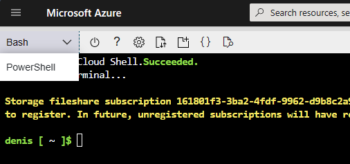

# Prerequisite

Let's provision our first resources in Azure!

It is recommended to use Azure Cloud Shell for the exercises, as it has all the tools you need to complete the exercises. You can access the Azure Cloud Shell via the portal or go to [shell.azure.com](https://shell.azure.com/).

1. Make sure the Cloud Shell is using PowerShell:

    

1. Clone this repository into the Cloud Shell:

    ```ps1
    git clone https://github.com/Lybecker/azure-secure-networking-for-devs
    ````

1. Navigate to folder `/exercises/scripts/`:

    ```ps1
    cd ./azure-secure-networking-for-devs/exercises/scripts/
    ```

1. Make sure the current Subscription is the expected one

    ```ps1
    az account show
    ```

    > If you have multiple subscriptions, you can list them with `az account list` and then set the desired one with `az account set --subscription <subscription name or ID>`.

1. Setup the environment with the following command:

    ```ps1
    .\mini-session.ps1 -TeamName <your team name>
    ```

    > **Important!**
    >
    > The team name should be given as lower case alphanumeric characters with the maximum length of 10. This is because it is used in the resource names that can have very short allowed length.

    > Make sure your working directory is `scripts` when running the script. This is because the web app code package to deploy is referenced using a relative path.

    > In case of an error message *"The file {path}\set-env.ps1 is not digitally signed. You cannot run this script on the current system."*, change the execution policy with the following command:
    >
    > ```ps1
    > Set-ExecutionPolicy -ExecutionPolicy RemoteSigned -Scope CurrentUser
    > ```

    If all goes well, you should now have the [resources](#status-check) deployed including the code for the web apps.

    > In case of any other errors, try rerunning the prerequisites script. The script is idempotent.

## Status check

Test the web apps and generate blobs:

1. In your browser, navigate to the web app: `https://app-<your team name>-dev-eu.azurewebsites.net/`
1. Generate blobs: `https://app-<your team name>-dev-eu.azurewebsites.net/create_blobs`
1. List blobs: `https://app-<your team name>-dev-eu.azurewebsites.net/list_blobs`
